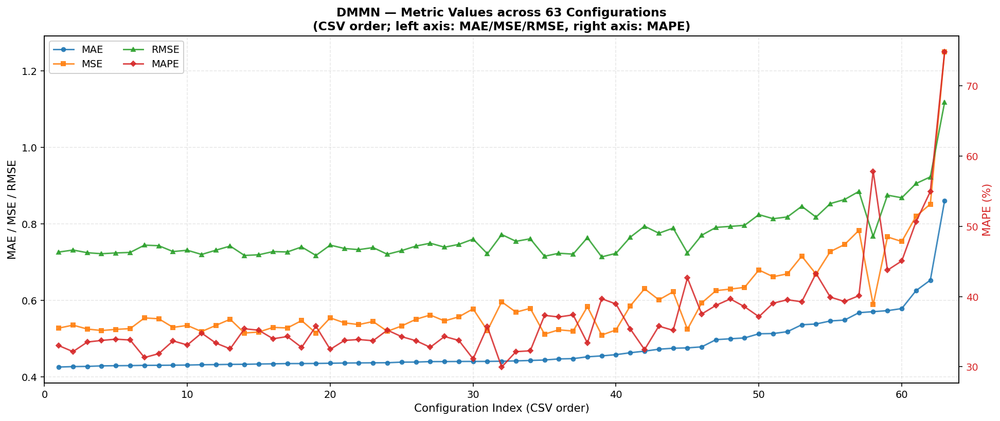

# DMMN — Hyperparameter Search Results

## 🏆 Best Configuration

| batch_size | dropout | lr | epochs | MAE | MSE | RMSE | MAPE |
|---:|---:|---:|---:|---:|---:|---:|---:|
| 64 | 0.1 | 0.0007 | 7 | **0.426101** | 0.527779 | 0.726484 | 33.0257 |

## 📊 Visualization

## 📋 Full Grid Search (63 configurations)

| Rank | batch_size | dropout | lr | MAE | MSE | RMSE | MAPE | epochs |
|:---:|---:|---:|---:|---:|---:|---:|---:|---:|
| 1 | 64 | 0.1 | 0.0007 | 0.426101 | 0.527779 | 0.726484 | 33.0257 | 7 |
| 2 | 64 | 0.1 | 0.0001 | 0.427265 | 0.535619 | 0.731860 | 32.1651 | 10 |
| 3 | 256 | 0.2 | 0.001 | 0.427771 | 0.525363 | 0.724819 | 33.5323 | 9 |
| 4 | 64 | 0.2 | 0.0001 | 0.429140 | 0.521498 | 0.722148 | 33.7626 | 11 |
| 5 | 128 | 0.1 | 0.0001 | 0.429615 | 0.524548 | 0.724257 | 33.9404 | 12 |
| 6 | 256 | 0.2 | 0.0003 | 0.429880 | 0.526452 | 0.725570 | 33.8205 | 9 |
| 7 | 64 | 0.1 | 0.001 | 0.430504 | 0.554385 | 0.744571 | 31.3236 | 7 |
| 8 | 64 | 0.2 | 0.0007 | 0.430623 | 0.552290 | 0.743162 | 31.8786 | 7 |
| 9 | 256 | 0.1 | 0.0001 | 0.430932 | 0.529757 | 0.727844 | 33.6922 | 18 |
| 10 | 256 | 0.3 | 0.0001 | 0.431267 | 0.534777 | 0.731285 | 33.1145 | 14 |
| 11 | 256 | 0.1 | 0.0003 | 0.432087 | 0.518776 | 0.720261 | 34.8116 | 11 |
| 12 | 256 | 0.2 | 0.0001 | 0.432458 | 0.535022 | 0.731452 | 33.3771 | 14 |
| 13 | 128 | 0.3 | 0.001 | 0.433062 | 0.550961 | 0.742268 | 32.5662 | 8 |
| 14 | 128 | 0.3 | 0.0001 | 0.433292 | 0.515038 | 0.717661 | 35.4207 | 13 |
| 15 | 128 | 0.2 | 0.0001 | 0.434001 | 0.517570 | 0.719423 | 35.2122 | 10 |
| 16 | 256 | 0.1 | 0.002 | 0.434485 | 0.529681 | 0.727792 | 34.0000 | 8 |
| 17 | 128 | 0.2 | 0.0005 | 0.435160 | 0.528204 | 0.726776 | 34.3147 | 8 |
| 18 | 64 | 0.3 | 0.0001 | 0.435194 | 0.547489 | 0.739925 | 32.7671 | 10 |
| 19 | 256 | 0.3 | 0.0003 | 0.435483 | 0.515057 | 0.717675 | 35.7860 | 11 |
| 20 | 128 | 0.2 | 0.0003 | 0.436043 | 0.554593 | 0.744710 | 32.4879 | 8 |
| 21 | 256 | 0.3 | 0.0007 | 0.436584 | 0.541481 | 0.735854 | 33.7651 | 9 |
| 22 | 128 | 0.1 | 0.0003 | 0.436873 | 0.537090 | 0.732864 | 33.8902 | 8 |
| 23 | 256 | 0.2 | 0.0005 | 0.437110 | 0.545027 | 0.738260 | 33.7186 | 10 |
| 24 | 256 | 0.3 | 0.0005 | 0.437331 | 0.519480 | 0.720750 | 35.2302 | 9 |
| 25 | 64 | 0.3 | 0.0005 | 0.438939 | 0.533444 | 0.730373 | 34.2930 | 8 |
| 26 | 128 | 0.2 | 0.0007 | 0.439087 | 0.550913 | 0.742235 | 33.7240 | 8 |
| 27 | 128 | 0.3 | 0.0003 | 0.440303 | 0.562033 | 0.749688 | 32.7852 | 9 |
| 28 | 256 | 0.2 | 0.0007 | 0.440387 | 0.546558 | 0.739295 | 34.3178 | 9 |
| 29 | 128 | 0.1 | 0.0007 | 0.440661 | 0.557303 | 0.746527 | 33.7645 | 8 |
| 30 | 64 | 0.2 | 0.001 | 0.440768 | 0.578125 | 0.760345 | 31.1376 | 7 |
| 31 | 256 | 0.1 | 0.001 | 0.440826 | 0.521405 | 0.722084 | 35.7108 | 9 |
| 32 | 64 | 0.2 | 0.002 | 0.441332 | 0.596532 | 0.772355 | 29.9706 | 6 |
| 33 | 128 | 0.1 | 0.001 | 0.442154 | 0.569436 | 0.754610 | 32.1636 | 8 |
| 34 | 128 | 0.2 | 0.001 | 0.443264 | 0.579493 | 0.761244 | 32.2836 | 8 |
| 35 | 256 | 0.1 | 0.0005 | 0.444489 | 0.511992 | 0.715536 | 37.3287 | 9 |
| 36 | 128 | 0.1 | 0.0005 | 0.447323 | 0.523370 | 0.723443 | 37.1012 | 8 |
| 37 | 128 | 0.3 | 0.0005 | 0.448083 | 0.520044 | 0.721141 | 37.3997 | 8 |
| 38 | 256 | 0.3 | 0.001 | 0.452852 | 0.583834 | 0.764090 | 33.3890 | 9 |
| 39 | 64 | 0.1 | 0.0003 | 0.455238 | 0.509667 | 0.713910 | 39.7017 | 9 |
| 40 | 64 | 0.3 | 0.001 | 0.458476 | 0.523050 | 0.723222 | 38.9484 | 7 |
| 41 | 256 | 0.3 | 0.002 | 0.463480 | 0.585838 | 0.765400 | 35.3983 | 8 |
| 42 | 64 | 0.3 | 0.0007 | 0.467633 | 0.630641 | 0.794129 | 32.4502 | 7 |
| 43 | 128 | 0.3 | 0.0007 | 0.472719 | 0.601756 | 0.775729 | 35.7991 | 8 |
| 44 | 256 | 0.1 | 0.003 | 0.475234 | 0.622682 | 0.789102 | 35.1958 | 7 |
| 45 | 64 | 0.2 | 0.0003 | 0.476128 | 0.524708 | 0.724367 | 42.6550 | 9 |
| 46 | 256 | 0.1 | 0.0007 | 0.478864 | 0.593709 | 0.770525 | 37.5243 | 9 |
| 47 | 64 | 0.3 | 0.0003 | 0.497715 | 0.625796 | 0.791073 | 38.7603 | 9 |
| 48 | 64 | 0.1 | 0.003 | 0.499964 | 0.629748 | 0.793567 | 39.6733 | 6 |
| 49 | 64 | 0.2 | 0.0005 | 0.502203 | 0.634268 | 0.796409 | 38.5600 | 8 |
| 50 | 128 | 0.1 | 0.002 | 0.513018 | 0.679671 | 0.824422 | 37.1420 | 8 |
| 51 | 128 | 0.2 | 0.002 | 0.513599 | 0.662045 | 0.813661 | 39.0666 | 8 |
| 52 | 256 | 0.2 | 0.003 | 0.518546 | 0.669668 | 0.818332 | 39.5545 | 8 |
| 53 | 256 | 0.3 | 0.003 | 0.536590 | 0.715967 | 0.846148 | 39.2683 | 8 |
| 54 | 256 | 0.2 | 0.002 | 0.538564 | 0.668956 | 0.817897 | 43.3038 | 8 |
| 55 | 128 | 0.1 | 0.003 | 0.546535 | 0.727888 | 0.853164 | 39.9250 | 7 |
| 56 | 64 | 0.3 | 0.003 | 0.548842 | 0.746262 | 0.863865 | 39.3116 | 7 |
| 57 | 128 | 0.3 | 0.003 | 0.568130 | 0.783158 | 0.884962 | 40.1283 | 6 |
| 58 | 64 | 0.1 | 0.0005 | 0.570838 | 0.588965 | 0.767441 | 57.8540 | 8 |
| 59 | 64 | 0.3 | 0.002 | 0.573457 | 0.766085 | 0.875263 | 43.7641 | 6 |
| 60 | 64 | 0.2 | 0.003 | 0.578866 | 0.754060 | 0.868366 | 45.0815 | 7 |
| 61 | 64 | 0.1 | 0.002 | 0.625767 | 0.820127 | 0.905609 | 50.6609 | 6 |
| 62 | 128 | 0.3 | 0.002 | 0.653161 | 0.851870 | 0.922968 | 54.9768 | 7 |
| 63 | 128 | 0.2 | 0.003 | 0.861199 | 1.250045 | 1.118054 | 74.8831 | 6 |
