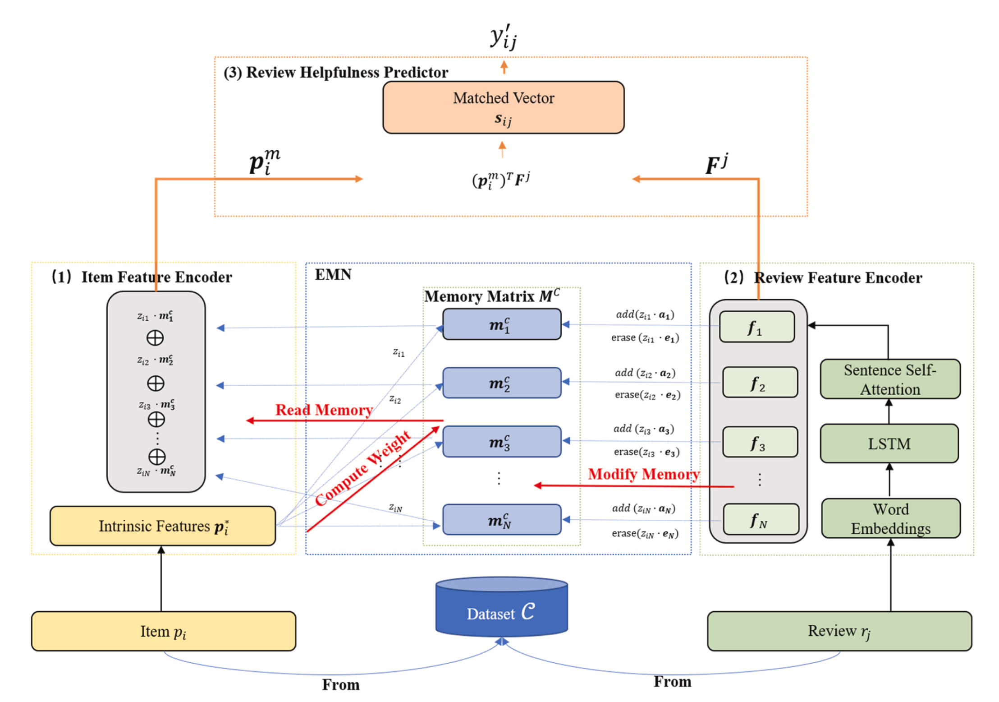

<h2><a href="https://www.sciencedirect.com/science/article/pii/S1568494622006731">DMMN - Deep Matching Model with feature-aware external Memory Network</a></h2>
리뷰 텍스트와 메타데이터 간 matching degree를 외부 메모리 네트워크로 학습하는 멀티모달 베이스라인

<h2>🏛️Architecture</h2>

  

  <i>Wang, S., & Qiu, J. (2023). Utilizing a feature-aware external memory network for helpfulness prediction in e-commerce reviews. Applied Soft Computing, 148, 110923.</i>

<h2>🔎Overview</h2>

- DMMN: EMN 기반으로 리뷰 텍스트-메타데이터 간 상호작용을 학습하는 리뷰 유용성 예측 모델
- 본 구현: item 정보를 steam 리뷰 작성자의 6가지 메타데이터로 대체하여 Steam 리뷰 유용성(votes_up) 예측 수행

<h2>🔧Using tool</h2>

* Python 3.10-3.12, RTX 4090 / CUDA 12.x (RunPod)
* <code>tensorflow==2.18.1</code> - Embedding, Bidirectional LSTM, MLP, 커스텀 EMN Layer
* <code>gensim>=4.3.0</code> - Word2Vec (300d, train split만 fit)
* <code>nltk>=3.8.0</code> - word_tokenize
* <code>scikit-learn>=1.3</code> - split, StandardScaler, MAE/MSE/MAPE 메트릭
* <code>numpy&lt;2.0</code>, <code>pandas>=2.0</code>, <code>scipy</code>, <code>tqdm</code>

<h2>🎯Target</h2>

   * 학습 타깃:
      원시 votes_up 안정 회귀 위해 로그 변환 적용 → <code>log(votes_up + 1)</code>
   * q99 cutoff:
      long-tail 영향 완화 위해 train split의 99 퍼센타일 초과 샘플 제거
   * 데이터 누수 방지:
      q99 cutoff는 train split에만 적용, validation/test 미적용

<h2>Input Modality</h2>
  - 2개 모달: 텍스트 + 메타데이터

  <h3>텍스트 모달리티</h3>
  - clean_review를 NLTK tokenizer로 토큰화
  - 사전학습된 Word2Vec (300차원)으로 초기화한 Embedding layer
  - Bidirectional LSTM (150 units, return_sequences=True)으로 양방향 문맥 추출
  - 시간축에 대해 mean pooling -> 300차원 리뷰 특징 벡터 review_feature (rf)
  - Dropout 적용
  
  <h3>메타데이터 모달리티</h3>
  
  - 6개 feature
    1. 작성자 누적 리뷰 수
    2. 보유 게임 수
    3. 총 플레이타임
    4. 리뷰 작성 시점 플레이타임
    5. 리뷰 작성 시각
    6. 무료 제공 여부
  - 분포 안정화: log1p 변환
  - 정규화: train split만으로 fit한 StandardScaler 적용
  - MLP: Dense(64, ReLU) -> Dense(300, tanh)
  - 텍스트 임베딩과 동일한 300차원 메타 특징 벡터 meta_feature (mf)로 사영
  - Dropout 적용
  
  

  
  <h2>📝Architecture Details</h2>
  
    <h3>1) Input Modality (Text + Metadata)</h3>
      * 입력 데이터:
        리뷰 텍스트와 작성자 메타데이터를 사용하는 2개 모달 입력 구조
         
      * 목표:
        텍스트 내용과 작성자 특성 간 상호작용을 함께 학습하여 리뷰 유용성 예측 수행
  
  
  <h3>2) Text Modality Embedding + BiLSTM</h3>
    * 텍스트 전처리:
      clean_review를 NLTK tokenizer로 토큰화 
    * 임베딩:
       사전학습된 300차원 Word2Vec으로 Embedding layer 초기화 
    * 문맥 특징 추출:
        Bidirectional LSTM (150 units, return_sequences=True) 적용 → 양방향 문맥 정보 학습 
    * 특징 압축:
       시간축(mean pooling) 적용 → 300차원 리뷰 특징 벡터 review_feature (rf) 생성 
    * 일반화:
       Dropout 적용

  <h3>3) Metadata Projection</h3>
    * 입력 feature: 
      작성자 누적 리뷰 수 / 보유 게임 수 / 총 플레이타임 / 리뷰 작성 시점 플레이타임 / 리뷰 작성 시각 / 무료 제공 여부

    
   * 전처리:
      log1p 변환으로 분포 안정화 → train split 기준 StandardScaler 정규화

  * 특징 변환:
      MLP(Dense(64, ReLU) → Dense(300, tanh)) 적용

  * 결과:
  
     텍스트 임베딩과 동일한 표현 공간의 300차원 메타 특징 벡터 meta_feature (mf) 생성
  
  * 일반화:
  
     Dropout 적용
  
  <h3>4) Controller + External Memory Network</h3>
  
  * Controller 생성:
  
     review_feature(rf)와 meta_feature(mf)를 element-wise multiply하여 controller 벡터 생성
  
  * 메모리 구조:
  
     학습 가능한 External Memory (100 slots × 300 dimensions)
  
  * Read 연산:
  
     softmax 기반 read weight 계산 → 메모리 슬롯 가중합 → meta_memory 벡터 생성
  
  * Write 연산:
  
     add vector와 erase vector를 통해 메모리 상태 점진적 갱신
  
  * 메모리 업데이트:
  
     new_memory = memory × (1 − ew × ee) + ew × ea
  
  * 역할:
  
     학습 과정에서 작성자–리뷰 간 전형적 상호작용 패턴 저장 및 활용
  
  <h3>5) Regression Head</h3>
  * 특징 결합:
     meta_memory와 review_feature를 element-wise multiply하여 output_feat 생성
  * 예측 구조:
     Dense(1, linear)
  * 역할:
     최종 리뷰 유용성 점수(votes_up) 회귀 예측
