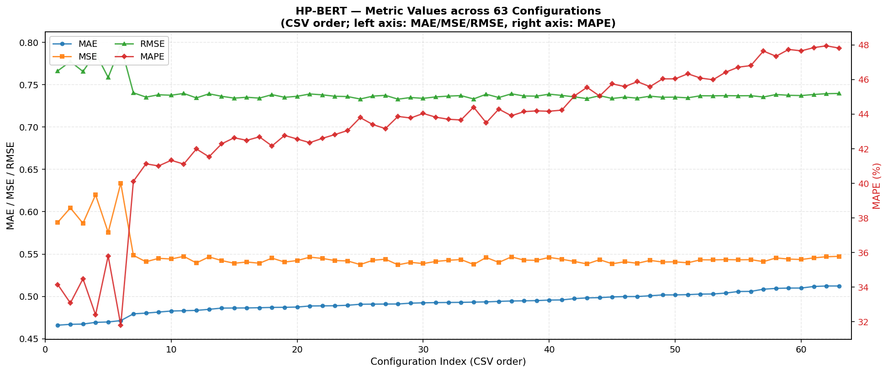

# HP-BERT — Hyperparameter Search Results

## 🏆 Best Configuration

| batch_size | dropout | lr | epochs | MAE | MSE | RMSE | MAPE |
|---:|---:|---:|---:|---:|---:|---:|---:|
| 64 | 0.1 | 0.002 | 6 | **0.465943** | 0.587512 | 0.766493 | 34.1426 |

## 📊 Visualization

## 📋 Full Grid Search (63 configurations)

| Rank | batch_size | dropout | lr | val_MAE | val_MSE | val_RMSE | val_MAPE | epochs | sec |
|:---:|---:|---:|---:|---:|---:|---:|---:|---:|---:|
| 1 | 64 | 0.1 | 0.002 | 0.465943 | 0.587512 | 0.766493 | 34.1426 | 6 | 14.7 |
| 2 | 64 | 0.3 | 0.003 | 0.466968 | 0.604550 | 0.777528 | 33.0734 | 16 | 34.8 |
| 3 | 64 | 0.2 | 0.002 | 0.467260 | 0.586347 | 0.765733 | 34.4768 | 6 | 15.5 |
| 4 | 64 | 0.2 | 0.003 | 0.469300 | 0.619993 | 0.787396 | 32.3872 | 10 | 23.6 |
| 5 | 64 | 0.3 | 0.002 | 0.469757 | 0.575614 | 0.758693 | 35.7969 | 6 | 15.1 |
| 6 | 64 | 0.1 | 0.003 | 0.471361 | 0.633733 | 0.796074 | 31.7930 | 6 | 14.2 |
| 7 | 256 | 0.1 | 0.0007 | 0.479361 | 0.548484 | 0.740597 | 40.1119 | 9 | 8.8 |
| 8 | 256 | 0.1 | 0.001 | 0.480222 | 0.540872 | 0.735440 | 41.1218 | 25 | 20.4 |
| 9 | 256 | 0.2 | 0.002 | 0.481456 | 0.544948 | 0.738206 | 40.9993 | 13 | 11.8 |
| 10 | 256 | 0.2 | 0.001 | 0.482684 | 0.544160 | 0.737672 | 41.3254 | 14 | 12.4 |
| 11 | 256 | 0.3 | 0.002 | 0.483067 | 0.547289 | 0.739790 | 41.1071 | 13 | 11.4 |
| 12 | 256 | 0.1 | 0.002 | 0.483420 | 0.539511 | 0.734514 | 41.9833 | 16 | 13.7 |
| 13 | 256 | 0.3 | 0.001 | 0.484695 | 0.546657 | 0.739362 | 41.5276 | 14 | 12.2 |
| 14 | 128 | 0.2 | 0.0003 | 0.486149 | 0.542332 | 0.736432 | 42.2758 | 25 | 30.8 |
| 15 | 128 | 0.1 | 0.0003 | 0.486259 | 0.539120 | 0.734248 | 42.6287 | 20 | 25.7 |
| 16 | 64 | 0.1 | 0.0001 | 0.486341 | 0.540616 | 0.735266 | 42.4798 | 20 | 41.8 |
| 17 | 256 | 0.1 | 0.0001 | 0.486581 | 0.539148 | 0.734267 | 42.6833 | 57 | 42.3 |
| 18 | 128 | 0.3 | 0.0003 | 0.486950 | 0.545212 | 0.738385 | 42.1555 | 17 | 21.8 |
| 19 | 64 | 0.1 | 0.001 | 0.487081 | 0.540553 | 0.735223 | 42.7652 | 8 | 18.7 |
| 20 | 64 | 0.2 | 0.0001 | 0.487380 | 0.542308 | 0.736416 | 42.5551 | 26 | 54.6 |
| 21 | 256 | 0.2 | 0.0007 | 0.488647 | 0.546356 | 0.739159 | 42.3461 | 8 | 8.4 |
| 22 | 64 | 0.3 | 0.0001 | 0.488783 | 0.544828 | 0.738125 | 42.5962 | 20 | 41.3 |
| 23 | 256 | 0.1 | 0.0005 | 0.488948 | 0.542312 | 0.736419 | 42.8154 | 10 | 9.7 |
| 24 | 256 | 0.2 | 0.0001 | 0.489476 | 0.541879 | 0.736125 | 43.0471 | 44 | 33.4 |
| 25 | 128 | 0.1 | 0.0005 | 0.490684 | 0.537565 | 0.733188 | 43.7963 | 19 | 23.6 |
| 26 | 64 | 0.2 | 0.001 | 0.490819 | 0.542626 | 0.736632 | 43.3929 | 8 | 19.0 |
| 27 | 256 | 0.3 | 0.0001 | 0.490948 | 0.543953 | 0.737531 | 43.1584 | 44 | 33.8 |
| 28 | 256 | 0.1 | 0.0003 | 0.490992 | 0.537274 | 0.732989 | 43.8635 | 33 | 26.4 |
| 29 | 256 | 0.2 | 0.0003 | 0.491988 | 0.540214 | 0.734993 | 43.7706 | 29 | 22.7 |
| 30 | 128 | 0.1 | 0.0001 | 0.492376 | 0.538760 | 0.734003 | 44.0334 | 31 | 37.6 |
| 31 | 128 | 0.2 | 0.0001 | 0.492632 | 0.541265 | 0.735707 | 43.8176 | 28 | 33.6 |
| 32 | 256 | 0.3 | 0.0003 | 0.492798 | 0.542651 | 0.736649 | 43.6980 | 29 | 23.0 |
| 33 | 128 | 0.3 | 0.0001 | 0.492930 | 0.543514 | 0.737234 | 43.6571 | 31 | 37.5 |
| 34 | 128 | 0.1 | 0.0007 | 0.493218 | 0.537709 | 0.733287 | 44.3995 | 19 | 23.6 |
| 35 | 256 | 0.3 | 0.0007 | 0.493468 | 0.545969 | 0.738897 | 43.4974 | 8 | 8.2 |
| 36 | 128 | 0.2 | 0.0005 | 0.494090 | 0.540126 | 0.734933 | 44.2848 | 19 | 23.5 |
| 37 | 128 | 0.3 | 0.002 | 0.494534 | 0.546663 | 0.739366 | 43.9017 | 7 | 10.1 |
| 38 | 128 | 0.3 | 0.0005 | 0.494740 | 0.542843 | 0.736779 | 44.1385 | 19 | 24.2 |
| 39 | 256 | 0.2 | 0.0005 | 0.495002 | 0.542594 | 0.736610 | 44.1827 | 10 | 9.8 |
| 40 | 64 | 0.3 | 0.001 | 0.495629 | 0.546036 | 0.738943 | 44.1619 | 7 | 16.5 |
| 41 | 256 | 0.3 | 0.0005 | 0.495796 | 0.543843 | 0.737457 | 44.2269 | 10 | 9.5 |
| 42 | 256 | 0.2 | 0.003 | 0.497336 | 0.541242 | 0.735692 | 45.0465 | 10 | 9.4 |
| 43 | 128 | 0.1 | 0.001 | 0.498230 | 0.538333 | 0.733712 | 45.5446 | 17 | 21.2 |
| 44 | 128 | 0.3 | 0.001 | 0.498485 | 0.543352 | 0.737124 | 45.0394 | 13 | 17.1 |
| 45 | 64 | 0.1 | 0.0003 | 0.499340 | 0.538530 | 0.733846 | 45.7448 | 17 | 35.5 |
| 46 | 128 | 0.2 | 0.001 | 0.499757 | 0.540916 | 0.735470 | 45.5889 | 17 | 22.1 |
| 47 | 256 | 0.1 | 0.003 | 0.499816 | 0.539084 | 0.734224 | 45.8729 | 10 | 9.6 |
| 48 | 128 | 0.3 | 0.0007 | 0.500705 | 0.542522 | 0.736561 | 45.5826 | 26 | 31.7 |
| 49 | 128 | 0.2 | 0.0007 | 0.501685 | 0.540587 | 0.735246 | 46.0335 | 17 | 21.9 |
| 50 | 64 | 0.2 | 0.0003 | 0.501758 | 0.540802 | 0.735392 | 46.0366 | 23 | 49.2 |
| 51 | 64 | 0.1 | 0.0007 | 0.502050 | 0.539666 | 0.734620 | 46.3278 | 21 | 44.5 |
| 52 | 128 | 0.2 | 0.002 | 0.502693 | 0.543234 | 0.737044 | 46.0815 | 17 | 21.7 |
| 53 | 64 | 0.3 | 0.0003 | 0.502818 | 0.543115 | 0.736964 | 45.9810 | 13 | 28.0 |
| 54 | 128 | 0.1 | 0.002 | 0.503889 | 0.543428 | 0.737175 | 46.4199 | 7 | 10.3 |
| 55 | 256 | 0.3 | 0.003 | 0.505748 | 0.543208 | 0.737027 | 46.7093 | 10 | 9.4 |
| 56 | 64 | 0.2 | 0.0007 | 0.505874 | 0.543376 | 0.737141 | 46.8016 | 14 | 30.4 |
| 57 | 64 | 0.1 | 0.0005 | 0.508481 | 0.541047 | 0.735559 | 47.6418 | 16 | 33.7 |
| 58 | 64 | 0.3 | 0.0007 | 0.509423 | 0.545430 | 0.738532 | 47.3403 | 14 | 30.8 |
| 59 | 128 | 0.1 | 0.003 | 0.509821 | 0.544069 | 0.737611 | 47.7354 | 17 | 20.7 |
| 60 | 64 | 0.2 | 0.0005 | 0.509835 | 0.543567 | 0.737270 | 47.6530 | 17 | 36.4 |
| 61 | 64 | 0.3 | 0.0005 | 0.511689 | 0.545471 | 0.738560 | 47.8409 | 14 | 31.6 |
| 62 | 128 | 0.2 | 0.003 | 0.512251 | 0.546855 | 0.739497 | 47.9449 | 8 | 11.7 |
| 63 | 128 | 0.3 | 0.003 | 0.512253 | 0.547276 | 0.739781 | 47.8109 | 16 | 20.6 |
