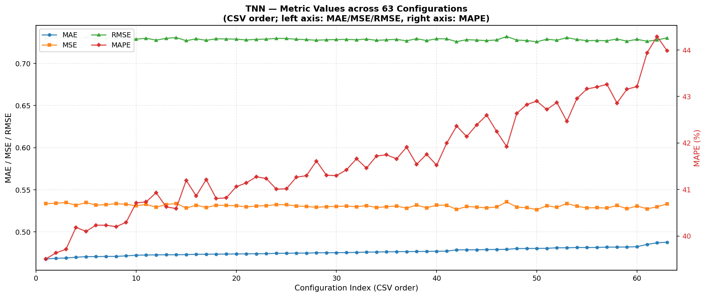

# TNN — Hyperparameter Search Results

## 🏆 Best Configuration

| batch_size | dropout | lr | epochs | MAE | MSE | RMSE | MAPE |
|---:|---:|---:|---:|---:|---:|---:|---:|
| 128 | 0.1 | 0.0007 | 15 | **0.467890** | 0.533518 | 0.730423 | 39.5065 |

## 📊 Visualization

## 📋 Full Grid Search (63 configurations)

| Rank | batch_size | dropout | lr | val_MAE | val_MSE | val_RMSE | val_MAPE | epochs | sec |
|:---:|---:|---:|---:|---:|---:|---:|---:|---:|---:|
| 1 | 128 | 0.1 | 0.0007 | 0.467890 | 0.533518 | 0.730423 | 39.5065 | 15 | 30.9 |
| 2 | 256 | 0.2 | 0.0001 | 0.468689 | 0.534008 | 0.730759 | 39.6379 | 58 | 57.8 |
| 3 | 256 | 0.1 | 0.0001 | 0.469007 | 0.534768 | 0.731278 | 39.7134 | 48 | 50.2 |
| 4 | 128 | 0.1 | 0.001 | 0.469875 | 0.531606 | 0.729113 | 40.1846 | 15 | 31.1 |
| 5 | 128 | 0.1 | 0.0001 | 0.470628 | 0.534745 | 0.731263 | 40.0993 | 28 | 53.6 |
| 6 | 128 | 0.2 | 0.0001 | 0.470650 | 0.531766 | 0.729223 | 40.2318 | 42 | 75.5 |
| 7 | 256 | 0.1 | 0.0003 | 0.470826 | 0.532250 | 0.729555 | 40.2316 | 26 | 29.8 |
| 8 | 128 | 0.1 | 0.0005 | 0.470902 | 0.533450 | 0.730376 | 40.2007 | 14 | 28.8 |
| 9 | 256 | 0.2 | 0.0003 | 0.471547 | 0.532766 | 0.729908 | 40.2922 | 43 | 44.5 |
| 10 | 64 | 0.2 | 0.0001 | 0.472309 | 0.530913 | 0.728638 | 40.7090 | 29 | 101.4 |
| 11 | 64 | 0.1 | 0.0001 | 0.472556 | 0.532625 | 0.729811 | 40.7326 | 25 | 88.9 |
| 12 | 64 | 0.3 | 0.0007 | 0.472716 | 0.529288 | 0.727522 | 40.9300 | 21 | 74.9 |
| 13 | 128 | 0.2 | 0.001 | 0.472824 | 0.532417 | 0.729669 | 40.6264 | 18 | 35.3 |
| 14 | 128 | 0.3 | 0.002 | 0.472870 | 0.533795 | 0.730613 | 40.5890 | 16 | 32.2 |
| 15 | 128 | 0.3 | 0.0007 | 0.473053 | 0.528282 | 0.726830 | 41.1952 | 25 | 47.5 |
| 16 | 256 | 0.3 | 0.0003 | 0.473378 | 0.531654 | 0.729146 | 40.8617 | 47 | 48.2 |
| 17 | 64 | 0.3 | 0.0003 | 0.473432 | 0.528983 | 0.727312 | 41.2126 | 22 | 78.9 |
| 18 | 128 | 0.3 | 0.0001 | 0.473559 | 0.531621 | 0.729124 | 40.8063 | 59 | 103.1 |
| 19 | 64 | 0.2 | 0.0003 | 0.473675 | 0.531338 | 0.728930 | 40.8188 | 16 | 59.1 |
| 20 | 256 | 0.1 | 0.0005 | 0.473816 | 0.531049 | 0.728731 | 41.0596 | 19 | 22.8 |
| 21 | 128 | 0.2 | 0.0005 | 0.473932 | 0.529566 | 0.727713 | 41.1421 | 22 | 42.7 |
| 22 | 128 | 0.1 | 0.0003 | 0.474059 | 0.530689 | 0.728484 | 41.2724 | 22 | 41.9 |
| 23 | 256 | 0.1 | 0.002 | 0.474113 | 0.531102 | 0.728767 | 41.2346 | 14 | 18.3 |
| 24 | 256 | 0.2 | 0.0007 | 0.474577 | 0.532348 | 0.729622 | 41.0069 | 20 | 23.8 |
| 25 | 256 | 0.3 | 0.0001 | 0.474598 | 0.532159 | 0.729492 | 41.0134 | 69 | 68.3 |
| 26 | 64 | 0.3 | 0.0005 | 0.474776 | 0.530778 | 0.728545 | 41.2632 | 16 | 59.2 |
| 27 | 128 | 0.2 | 0.0003 | 0.474819 | 0.530128 | 0.728099 | 41.2964 | 22 | 42.4 |
| 28 | 128 | 0.2 | 0.002 | 0.475189 | 0.529166 | 0.727438 | 41.6107 | 18 | 35.9 |
| 29 | 256 | 0.2 | 0.0005 | 0.475257 | 0.529880 | 0.727928 | 41.3068 | 26 | 28.5 |
| 30 | 256 | 0.3 | 0.0007 | 0.475328 | 0.530250 | 0.728183 | 41.2968 | 31 | 33.8 |
| 31 | 128 | 0.2 | 0.0007 | 0.475420 | 0.530612 | 0.728431 | 41.4221 | 18 | 36.0 |
| 32 | 256 | 0.1 | 0.0007 | 0.475672 | 0.529867 | 0.727920 | 41.6598 | 22 | 25.7 |
| 33 | 256 | 0.2 | 0.001 | 0.475960 | 0.531128 | 0.728786 | 41.4593 | 22 | 25.5 |
| 34 | 256 | 0.3 | 0.001 | 0.476108 | 0.528938 | 0.727281 | 41.7193 | 31 | 33.9 |
| 35 | 128 | 0.1 | 0.002 | 0.476321 | 0.529840 | 0.727901 | 41.7446 | 14 | 28.6 |
| 36 | 128 | 0.3 | 0.0003 | 0.476522 | 0.530681 | 0.728479 | 41.6571 | 27 | 50.3 |
| 37 | 128 | 0.3 | 0.0005 | 0.476587 | 0.528166 | 0.726750 | 41.9092 | 24 | 45.5 |
| 38 | 256 | 0.3 | 0.0005 | 0.476703 | 0.531773 | 0.729228 | 41.5402 | 31 | 33.8 |
| 39 | 64 | 0.2 | 0.0005 | 0.476834 | 0.528559 | 0.727020 | 41.7562 | 16 | 58.8 |
| 40 | 64 | 0.3 | 0.0001 | 0.476960 | 0.531694 | 0.729173 | 41.5195 | 29 | 102.2 |
| 41 | 64 | 0.2 | 0.003 | 0.477137 | 0.531561 | 0.729082 | 41.9945 | 13 | 48.7 |
| 42 | 256 | 0.2 | 0.002 | 0.478654 | 0.526668 | 0.725719 | 42.3631 | 19 | 23.2 |
| 43 | 128 | 0.3 | 0.001 | 0.478705 | 0.530095 | 0.728077 | 42.1364 | 17 | 33.7 |
| 44 | 256 | 0.1 | 0.001 | 0.478742 | 0.529399 | 0.727598 | 42.3903 | 16 | 20.3 |
| 45 | 64 | 0.1 | 0.0003 | 0.479017 | 0.528520 | 0.726994 | 42.5964 | 15 | 54.9 |
| 46 | 256 | 0.3 | 0.002 | 0.479143 | 0.529599 | 0.727735 | 42.2436 | 25 | 28.8 |
| 47 | 128 | 0.3 | 0.003 | 0.479247 | 0.535644 | 0.731877 | 41.9191 | 22 | 42.3 |
| 48 | 64 | 0.3 | 0.001 | 0.480213 | 0.529374 | 0.727581 | 42.6374 | 16 | 58.5 |
| 49 | 128 | 0.1 | 0.003 | 0.480276 | 0.528670 | 0.727097 | 42.8262 | 12 | 25.3 |
| 50 | 256 | 0.1 | 0.003 | 0.480356 | 0.526418 | 0.725546 | 42.8986 | 17 | 21.2 |
| 51 | 128 | 0.2 | 0.003 | 0.480490 | 0.530926 | 0.728646 | 42.7181 | 21 | 40.7 |
| 52 | 64 | 0.1 | 0.002 | 0.481111 | 0.529114 | 0.727402 | 42.8701 | 9 | 35.5 |
| 53 | 64 | 0.3 | 0.003 | 0.481161 | 0.533677 | 0.730532 | 42.4650 | 13 | 48.3 |
| 54 | 64 | 0.1 | 0.0005 | 0.481401 | 0.530408 | 0.728291 | 42.9554 | 12 | 45.5 |
| 55 | 64 | 0.1 | 0.0007 | 0.481415 | 0.528477 | 0.726964 | 43.1614 | 12 | 45.6 |
| 56 | 64 | 0.2 | 0.001 | 0.481495 | 0.528709 | 0.727124 | 43.2018 | 15 | 55.9 |
| 57 | 64 | 0.1 | 0.001 | 0.481910 | 0.528240 | 0.726802 | 43.2603 | 11 | 41.9 |
| 58 | 64 | 0.1 | 0.003 | 0.481953 | 0.531306 | 0.728908 | 42.8569 | 8 | 32.2 |
| 59 | 256 | 0.2 | 0.003 | 0.482066 | 0.527494 | 0.726288 | 43.1554 | 18 | 21.6 |
| 60 | 64 | 0.3 | 0.002 | 0.482406 | 0.530762 | 0.728534 | 43.2117 | 15 | 55.0 |
| 61 | 64 | 0.2 | 0.0007 | 0.485113 | 0.527359 | 0.726195 | 43.9346 | 13 | 49.4 |
| 62 | 64 | 0.2 | 0.002 | 0.487050 | 0.529672 | 0.727785 | 44.2885 | 14 | 51.8 |
| 63 | 256 | 0.3 | 0.003 | 0.487739 | 0.533247 | 0.730238 | 43.9832 | 16 | 20.1 |
